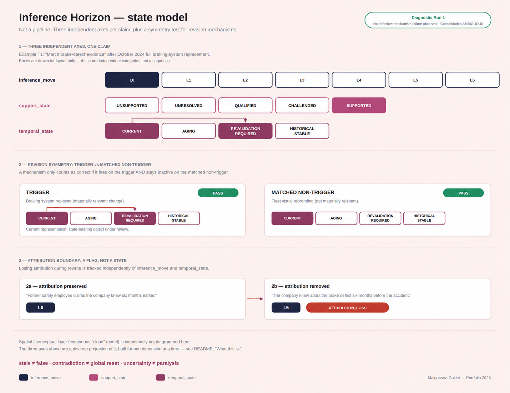

# Inference Horizon

A spatial-cloud model for tracking how justification changes, ages, and loses current applicability over time.

## What this is

Inference Horizon (IH) asks a narrower question than Claim Gate: not "is this claim supported right now", but "does a justification that was once valid still apply, and how would a system know?"

The concept is spatial, not a linear gate: justification is modeled as a cloud whose state of matter changes as different dimensions of justification vary — becoming more diffuse where the overall justificatory situation is less stable, more conditional or less well supported, and more consolidated where support and applicability are stronger.

This spatial metaphor is not equivalent to the discrete inference taxonomy used in the current implementation.

A discrete taxonomy (L0–L6) exists only as an operational projection of this space for one dimension — the type of epistemic move — so that the model can commit to a finite, testable set of state labels. It is not a confidence score, and temporal decay must never shift a claim between L-codes.

Initial target domain, introduced in v1.01: investigative journalism (fictional cases only).

  

## Why it exists

Gate-based evidence workflows, including an earlier one of mine, can treat a claim as settled once it passes a gate. Three things that get lost in that model:

| Problem | What it looks like |
|---|---|
| Conflating stale with false | A claim loses "current" applicability over time, but a binary system has no way to say that without marking it wrong. |
| Conflating contradiction with full reset | New counter-evidence should weaken a specific claim, not wipe its history or force a global re-evaluation. |
| Conflating attribution with the claim itself | "Source X says Y" and "Y" are different claims. Losing attribution during a rewrite is a critical, trackable event, not a style choice. |

IH's working principles: *expired justification ≠ disproved claim · stale ≠ false · contradiction ≠ global reset · uncertainty ≠ paralysis · revision must terminate · history must remain traceable · time may weaken applicability without erasing evidence.*

## State dimensions

Each atomic claim is tracked on independent axes, not a single verdict:

| Dimension | Values (working set) | Notes |
|---|---|---|
| `inference_move` | L0–L6 | Type of epistemic move only. Not a confidence score. L6 means fabrication, not "low confidence." |
| `support_state` | SUPPORTED / QUALIFIED / CHALLENGED / UNRESOLVED / UNSUPPORTED | Independent of inference type. |
| `temporal_state` | CURRENT / AGING / REVALIDATION_REQUIRED / HISTORICAL_STABLE | HISTORICAL_STABLE means no decay from time alone — new evidence can still destabilize it. |
| `probability_band` | optional, ICD 203-aligned probability bands | Annotation only. Does not map onto L0–L6 or replace the other two states. |

## Revision Symmetry

A revision mechanism is only considered correct if it passes two tests together: it fires on a **trigger** case, and stays inactive on a **matched non-trigger** — a closely similar stimulus that differs only in epistemic relevance.

A mechanism that reacts to everything new is a false positive machine, not a working one.

Example pair:

- *Trigger:* a company replaces its entire braking system after an earlier defect report → `temporal_state` moves to `REVALIDATION_REQUIRED`.
- *Matched non-trigger:* the same company changes its visual branding → nothing changes, because the new information isn't materially relevant to the claim.

## Example

All names, sources and events below are fictional (Vantage Rail Holdings).

| **Claim** | **Evidence** | **inference_move** | **support_state** | **temporal_state** | **Why** |
|---|---|---|---|---|---|
| Vantage Rail paid a $2.3M settlement in 2024. | Court records (S1) | L0 — Verbatim | SUPPORTED | HISTORICAL_STABLE | A historical fact doesn't decay just because time passed. |
| A former safety employee claims the company knew about the defect six months earlier. | Anonymous source (S2), attribution preserved | L0 — Verbatim | SUPPORTED | CURRENT | Attribution intact — no boundary event. |
| The company knew about the brake defect six months before the accident. | Same source, attribution removed | L5 | UNRESOLVED* | CURRENT | Losing attribution is a critical boundary event, flagged regardless of L-code. |

\*Support from the attributed claim does not transfer automatically; the exact resulting support state is not frozen in v1.04.

## Status

Inference Horizon is a self-initiated prototype. Baseline v1.04 was frozen before **Diagnostic Run 1** and then kept unchanged for subsequent cross-model testing.

Diagnostic Run 1 evaluated every trigger/matched-non-trigger pair defined in the baseline (materiality, temporal decay, destabilization, attribution boundary, consolidation).

No definitive mechanism failure was identified in the executable cases. However, several results remain qualified by incomplete test specifications and unresolved state-representation ambiguities.

In the initial ChatGPT run, one mechanism — Consolidation — returned AMBIGUOUS because the baseline requires a state change without specifying the concrete transition; the run correctly refused to invent one.

### Cross-model diagnostic

The v1.04 baseline was subsequently run across three black-box LLM environments: ChatGPT, Gemini, and Copilot.

All three broadly reproduced the same directional behavior across the available test cases:

- stale information was not treated as false,
- historical records were preserved,
- contradictory evidence triggered destabilization rather than temporal decay,
- attribution loss was detected as a boundary event,
- materially irrelevant new information did not trigger revision.

However, the runs also exposed model-dependent handling of underspecified rules.

The original run surfaced Consolidation as AMBIGUOUS because the baseline does not define its exact support-state transition. Gemini and Copilot instead completed the missing transition themselves, effectively inferring `QUALIFIED → SUPPORTED`.

A second ambiguity also reproduced across models: the distinction between a historically valid atomic claim and the present-day applicability of the evidence supporting that claim.

The current cross-model result is therefore:

**directionally consistent, but not yet specification-deterministic.**

This is treated as a diagnostic finding, not as validation of the architecture.

**Known limits:**

- The taxonomy currently implemented is a discrete, three-axis projection of the original continuous spatial model. Whether this projection fully preserves the source intuition, or has quietly flattened it, is still an open question — not yet resolved in either direction.
- Several matched non-trigger controls are defined directionally but not as fully instantiated test cases.
- Cross-model testing reproduced an unresolved question: whether historical claim truth and present-day evidence-to-claim applicability need separate state-bearing objects. This is not yet treated as an architectural conclusion.
- Enforcement relies on the model following instructions, the same limitation as Claim Gate.
- Cross-model diagnostic testing has been performed across three LLM environments, but all runs were designed, executed and reviewed within this project. No independent external evaluation has been conducted.
- Because the full baseline specification and diagnostic log are not currently public, the reported results should be treated as self-reported diagnostic findings rather than independently reproducible or externally validated results.

## Related work

IH builds on published ideas rather than claiming to originate them:

- Belief-R / ΔR (Wilie et al., 2024) — methodological anchor for separating UPDATE from MAINTAIN.
- Temporal justification logic (Ghari, 2021; journal version 2024) — prior art for formal temporal-epistemic reasoning.
- Micropublications (Clark, Ciccarese & Goble, 2014) — prior art for explicit modeling of claims, evidence, attribution, support and challenge.

Similarity to existing work isn't a failure of this project; it narrows what novelty can be claimed. Whether IH's specific combination is novel remains open.

## What is in this repository

- `README.md` — this overview
- `Inference-horizon-state-model.png` — the state model
- `LICENSE` — terms of use

The full specification and diagnostic test log are not published in this repository. If you'd like to discuss the architecture in more detail, please get in touch.

## License

Copyright (c) 2026 Małgorzata Dukiet. All rights reserved. See [LICENSE](./LICENSE).

Published for viewing only; may not be copied, modified, redistributed or used commercially without written permission.

## Author

Małgorzata Dukiet: art director, brand strategist, creative systems / AI workflow design.

For contact and permission requests, please use the contact information linked from my GitHub profile.

See also: [Claim Gate](https://github.com/mdukiet/claim-gate), a related project on evidence-based claim governance.
